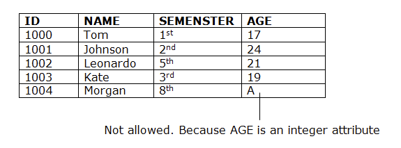
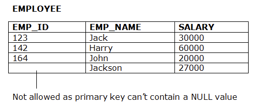
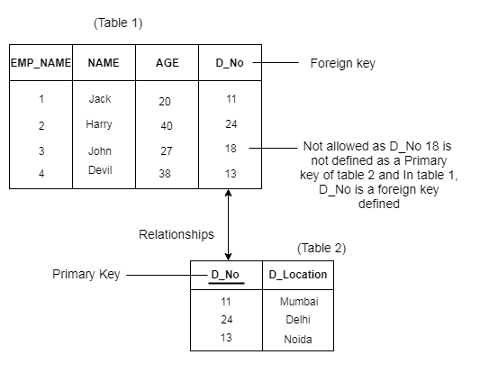
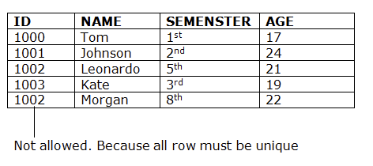

# Week 7

## Programming RDB

#### Subjects
* **Advanced SQL**
* **Integration Constrains**
* **Triggers**
* **Stored Procedures**
* **User-Defined Functions**
* **View**

***

#### Teachings and Learning & Materials
**<a href="https://datsoftlyngby.github.io/soft2020spring/DB/week-07/#2-programming-rdb">Link</a>**

*** 
#### Advanced SQL

#### Integration Constrains

Integration Constrains are set of rules that protect the integrity and quality of the database. The rules prevennt accidental damage. There are many constrains for SQL databases, i will go through some of them. 

**Domain Constraint**
Domain Constraint are a set of rules made to define what is valid as a value. This constraint protect the user from inserting an Integer value when the predifined value are VARCHAR, as an example.



**Entity Integrity Constraint**
Entity Integrity constraint prevents the primary key to be null. The primary key is used to identify each row, so by being able to insert it as null, would brake this integrity meaning i wouldn't be able to identify a single row. 



**Referential Integrity Constraint**
Referential integrity constraint is between two tables. if the foreign key in table 1 refers to primary key in table 2, then every value of the Foreign key in Table 1 must be null or be available in table 2.



**Key Constrait**
Keys are used to identify a row by in its table. This constraint prevent duplication in the table. because every key is unique.



#### Stored Procedures
Stores procedures are used to group one or more SQL-transactions statements into one logical unit. They are stored as named objects in SQLServer database server.

When called first time SQL server creates an execution plan and stores it in a the cache. when executed again it will reuse the execution plan inside the cache for better, and more reliable performance.

In stored Procedures we have the option to execute statements in a block where we can handle execption and have conditional output. 

#### Triggers
Triggers are special stored procedures that are executed automatically in response to the database obkect, database and server events. SQL Server provides three type of triggers


* **Data manipulation language (DML)** triggers which are invoked automatically in response to INSERT, UPDATE and DELETE events against tables.
* **Data definition language (DDL)** triggers which fire in response to CREATE, ALTER and DROP statements. DDL Triggers also fire in response to some system procedures that perform DDL-like operations.
* **Logon trigger** which fire in response to LOGON events.

Simple example of a trigger
```SQL
CREATE TRIGGER [schema_name.]trigger_name
ON table_name
AFTER {[INSERT], [UPDATE], [DELETE]}
[NOT FOR REPLICATION]
AS
{sql_statements}
```
* *trigger_name* Is the user defined identifier for the trigger.
* *On table_name* Is on which table the trigger is applied.
* *AFTER* clause indicate when the trigger should be executed.
* *NOT FOR REPLICATION* instruct SQL server not to fire again when execution of changes inside the trigger happens.
* *sql_statemetns* is one or more Transact-SQL used to carry out actions once an event occurs.


#### User-Defined Functions
**Scalar functions**
Scalar functions are functions that takes in one or more paramenters and returns a single value - Tuples are not an option. Server Scalar functions are used and reused in Queries. 

A simple Create implementation of a scalar function
```SQL
CREATE FUNCTION sales.udfNetSale(
  @quantity INT,
  @list_price DEC(10,2)
  @discount DEC(4,2)
)
RETURNS DEC(10,2)
AS 
BEGIN
  RETURN @quantity * @list_price * ( 1 - @discount );
END;
```
Calling the function
```SQL
SELECT sales.udfNetSale( 10, 100, 0.1 ) net_sales;
```

But sometimes what we want is to modify a specific value. In that case it the blueprint would look this way.

```SQL
ALTER FUNCTION [ Schema_name ] function_name ( parameter list ) 
  RETURN data_type AS
  BEGIN
    statement
    RETURN value
  END
```

**Instead of trigger**
An Instead of trigger is a trigger that allows you to skip an INSERT, DELETE or UPDATE statement table or a view and execute other statements deifend in the trigger instead. The actual INSERT, DELETE or UPDATE operation does not occur at all. 

an Instead of trigger skips a DML statement and execute other statements

Example
```SQL
CREATE TRIGGER [schema_name.]trigger_name
ON { table_name | view_name }
INSTEAD OF { [INSERT] [,] [UPDATE] [,] [DELETE] }
AS 
{sql_statements}
```

<a href="https://www.sqlservertutorial.net/sql-server-triggers/sql-server-instead-of-trigger/"> More about instead of trigger</a>

#### View

Views is a virtual table, that that is created by query based on a specific outcome. It can prevent unwanted exposure of a column. 

The view is up to date and is not counted as old.

###### Why use Views? 
Views is a good security precaustion. Via Views we can restrict what we want to return. in sort it gives following benefits.

* Query simplicity
* business logic consistency
* Security

***It is important to underline that the view does not improve on the query execution performance.***


###### How to use views?

Example
```SQL
CREATE VIEW [ upcomming_table_name ] AS
SELECT { [table].attributes } 
FROM [ table ]
```
So Basically for calling the select statement, i would only have to call this
```SQL
SELECT * FROM [upcomming_table_name];
```
And this would return the result of the view.

Types of Views
* Indexed views
* Partition Views
* System Views

**Indexed Views**

**Partition Views**

**System Views**

***
##### sources
**<a href="https://www.javatpoint.com/dbms-integrity-constraints">Integration Constrains</a>**
**<a href="https://www.sqlservertutorial.net/sql-server-stored-procedures/">Storage Procedures</a>**
**<a href="https://www.sqlservertutorial.net/sql-server-user-defined-functions/sql-server-scalar-functions/">User-defined functions</a>**
**<a href="https://www.youtube.com/watch?v=8jU8SrAPn9c" >Youtube video about views</a>**

