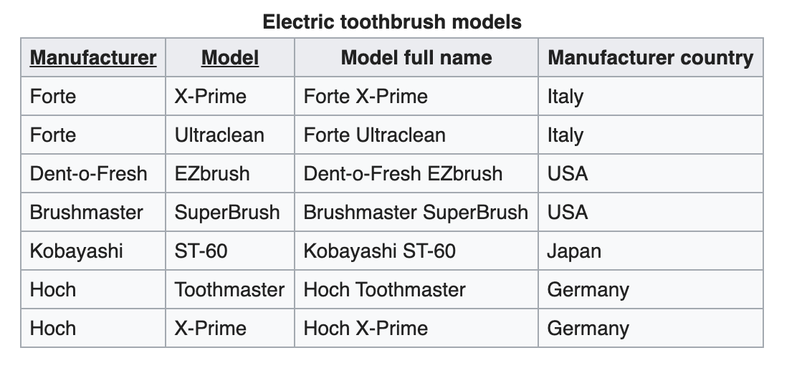
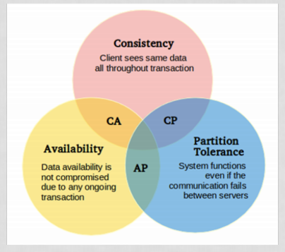

# Semester Course

A cheatsheet undergoing what we have talked about in the semester.

****

## 1. knows various database types and the underlying models (1, 6, 8, 12, 15)

### PostgreSQL ( 1 )

PostgreSQL is a branch of the SQL databases. A very old and robust database created in 1986.

#### RDB Modelling and Design

Design and modelling of SQL databases, usually happens with ER Diagrams which will give an overview of the content in the table but also the relations between tables.

#### Normalisation and De-normalization

#### Normalization Rules
Normalization rules are divided into Normalization forms, to complete a form some specifications have to be met. There are currently 4 Forms and some would argue there are 6. We will cover them all in here.

**Normalization Form 1**
```diff
- Every Column Should only have a Single(Atomic) Value.
- Values Stored in a column should be of same domain.
- All the columns in a table should have unique names.
- And the order in which data is stored, does not matter.
```

*Values stores in a column should be of same domain*
As an example if we have a column labelled phone number, there should only be phone number values. We are not allowed to add for example an address in the value. 

*All the columns in a table should have unique names*
All column labels should have unique names, so we prevent the duplication of column labels for tables.

*And the order in which the data is stored, does not matter* 
The order which we insert in does not matter, there are no need to sort the table before we insert. 

**Normalization Form 2**
```diff
- First Normalizations steps should be completed.
- It should not have Partial Dependancy.
```

*First Normalizations stes should be completed*
The first normal form should be completed before moving to the second normal form

*It should not have Partial Dependancy*
Which is having one table/column dependent on another that cause duplication on one of the tables/columns. The following images explain it well.


As we can see Manufacturer country are dependent on Manufacturer, and can cause duplication if multiple models are made from the same Manufacturer. 

##### Normalization Form 3
```diff
- Second Normalization step should be completed.
- It doesn't have Transitive Dependancy.
```

*Second Normalization step should be completed*
Ut means we cannot move to third normal form without completing the first normal form.

*A relation has no Transitive Fucntional Dependancy on the primary key* 
It is when a table/column is dependent on a column that is dependent on another column. in short it means that a column is dependent on a column that is depended on a column, in one table. And that when editing can lead to unconsistency. 
(x -> y -> z) in one table 
That is transitive dependancy


<a href="https://www.youtube.com/watch?v=_K7fcFQowy8" > This is a great demonstration on Transitive Dependancy and how to spot them.</a>  


##### Boyce and Codd Normal Form (BCNF)
```diff
- Third Normal form should be completed.
- For each functional dependancy ( X -> Y ), X should be a super Key.
```
This Normal form is a higher level of the third form, and deals with anomalies not handled by the third Normal form. 

##### Normalization Form 4
```diff 
- BCNF Should be completed.
- It does not have Multi-Valued Dependancy.
```

##### Database Denormalization
```diff
- Denormalization is changing a normalized database for some performance gain. Usually it is used to increase the performance of the read functionality by making redundant data in the database.
```
An example for using denormalization in a database is, if the database is seperated on two different disks. In that case it will take a toll on the performance to retrieve and join tables. In that case it makes sence to denormalize the database and have redundant data to increase performance.

#### Relational Algebra

Is a widely used procedural query language. It collect instance of relations as input and give occurrences of relations as output. The following Operations for the language are:

**Unary Relational Operations**
```diff
- SELECT (symbol: σ)
- PROJECT (symbol: π)
- RENAME (symbol: ρ)
```

```diff
+ Examples with SELECT
σ topic = "Database" (Tutorials)
σ subject = "database" and price = "450"(Books)
```

```diff
+ Examples with PROJECT
σ topic = "Database" (Tutorials)
σ subject = "database" and price = "450"(Books)
```


**Relational Algebra Operations From Set Theory**
```diff
- UNION (υ)
- INTERSECTION ( )
- DIFFERENCE (-)
- CARTESIAN PRODUCT ( x )
```

**Binary Relational Operations**
```diff
- JOIN
- DIVISION
```


#### SQL: Types of SQL Commands - DDL | DML

With SQL we can execute certain operations like SELECT, INSERT, DELETE and more. Commands like those can be categorized like: 
```diff 
- DDL -> Data Definition Language
- DQL -> Data Query Language
- DML -> Data Manipulation Language
- DCL -> Data Control Language
- TCL -> Transaction Control Langauge
```

**DDL** is used to define the database schema. Its used to create and modify the structure of database objects. The following commands are considered DDL commands
- CREATE - used to create database or its objects 
- DROP - used to delete objects from the database
- ALTER - used to alter the structure of database
- TRUNCATE - used to remove all records from table, include space allocated for the records
- COMMENT - used to add comments to the data dictionary
- RENAME - is used to rename an object existing in the database

**DQL** is used for performing queries on the data within schema objects. DQL Command is to get some schema relation based on the query passed to it. Its command are the following:
- SELECT - retrieve data from a database

**DML** is used to manipulating the data within the database. Its commands are the following
- INSERT - insert data into a table
- UPDATE - update data in a table
- DELETE - delete data within a table

**DCL** is used primarily to work with security that mainly deal with rights and permissions. Its commands are the following:
- GRANT - gives user access privilages to database
- REVOKE - withdraw users access privilages gived by using the GRANT command

**TCL** is used to deal with the transaction within the database. Its commands are the following
- COMMIT - commits a transaction
- ROLLBACK - rollsback the transaction
- SAVEPOINT - sets a savepoint within a transaction
- SET TRANSACTION - specify characteristics for the transaction

#### ORM Object-Relational Mapping

SQL does not have an ORM, like many other databases. You have to write the statements your own application to execute it in the database. But now there are many reliable ORM's that can be used with SQL databases like PostgreSQL.

#### ACID Rules VS CAP Theorim 

##### ACID Rules
ACID which stands for Atomic Consistent Isolated Durability, is about insuring the data remaining consistance despite any failures.

**Atomic**
Atmoicity means guaranteeing thatx either everything succeed or nothing does

**Consistency**
This isures that the data is consitent in the transactions.

**Isolation**
This mean that current transactions are not effected by other transactions, like in deadlocks or updates. 

**Durability**
This mean after the transaction has succeeded the result would remain in the system permanently. 

##### CAP Theorim

CAP theorim basically states that it is not possible for a distributed data store to provide more than 2 of the following three guarantees. 

```diff
- Consistency
- Availabilty
- Partition tolerance
```

<center>

</center>


### NoSQL ( 6 )

#### knows various database types and the underlying models
There are various database types used in the world, and below are some of them.
```diff
- Column-Oriented Database -> Hbase
- Key-Value Stores -> Redis
- Document Stores -> MongDB
- Graph Databases -> Neo4j
```

**Column-Oriented Database**


**Key-Value Stores**
**Document Stores**
**Graph Databases**

#### knows a specific database system’s storage organisation and query execution
#### is able to use a specific database system’s tools for handling simultaneous transactions
#### have the skills to analyse the application domain in order to select a database type


****

## 2. knows a specific database system’s storage organisation and query execution
****
knows a specific database system’s optimisation possibilities – including advantages and disadvantages
****
knows database-specific security problems and their solutions
****
knows relational algebra (including its relationship to execution plans
****
knows a specific database system’s storage organisation and query execution (2, 12)
****
knows concepts and issues in relation to data warehousing, including big data (7, 12, 18)
****
knows the particular issues raised by having many simultaneous transactions, including in connection with distributed databases (7, 14)
****
is able to transform logical data models into physical models in various database types (1, 4, 12)
****
is able to use the programming and other facilities provided by a modern DBMS (2, 4, 7, 8, 13, 14, 15)
****
is able to implement database optimisation (3, 4)
****
is able to use parts of the administration tool to assist in the optimisation and tuning of existing databases, including the incorporation of a specific DBMS’ execution plans
****
is able to use an object-relational mapping tool
****
is able to use a specific database system’s tools for handling simultaneous transactions (6, 13, 14, 18)
****
have the skills to divide responsibility for tasks between the application and DBMS during system development, to ensure the best possible implementation. (4, 14, 18)
****
have the skills to analyse the application domain in order to select a database type (6, 8, 13, 15, 18)
****
## Word Defintions

