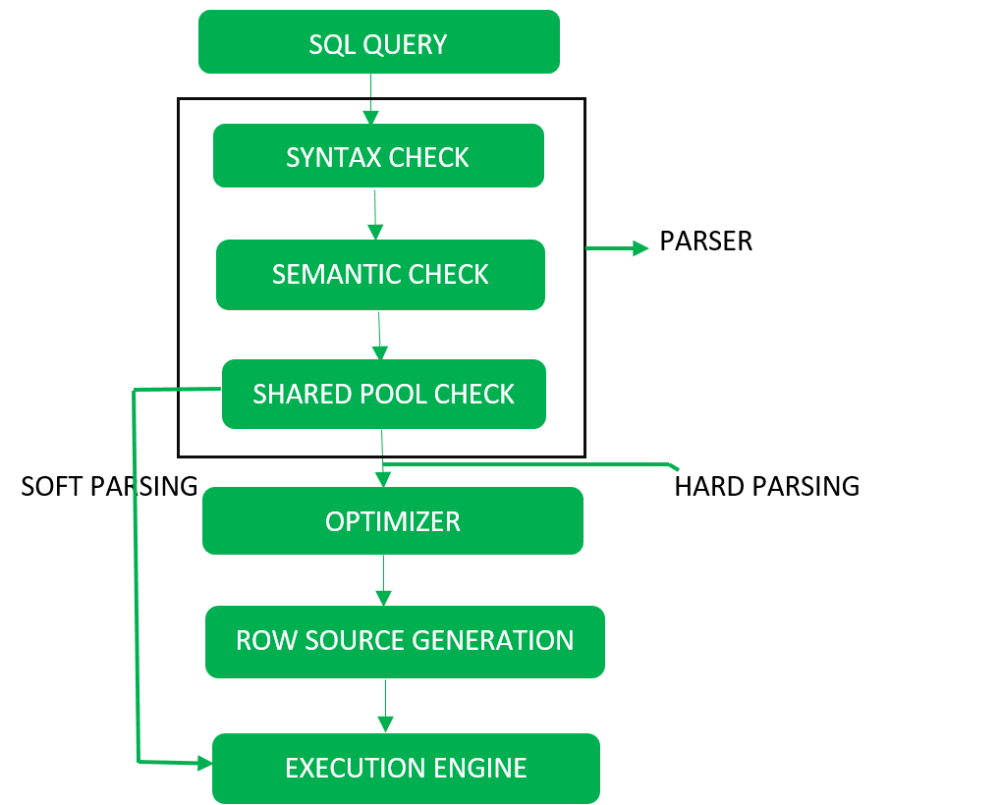
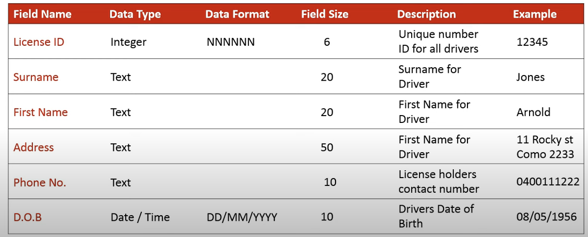
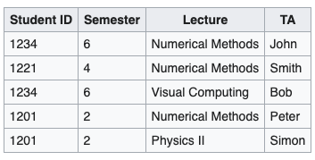

# Sample DB Questions, SOFT 2020 Spring

## All Database Types

### 1. Explain the following terms: data, information, database, and database management system. What is the difference? Give examples.

**Data**: is all the single items that are stored in the database.
**Information**: is meaningfull processed data. just simple data rows without proccessing is not meaningfull data.
**Database**: Database is an organized collection of data.
**Database management system**: DBMS is a system that helps managing the dabatase.

### 2. What is called a database schema? Which databases enable enforcing a hard schema, which are schemaless, and which enable storing semi-structured data?

#### What is.

**Database Schema**: Database schemas are the bone structure for any table and databases. it defined how the data is organized and how relations among them are assosiated.
**Hard Schema**: hard schema also called strict schema. Databases that uses them cannot take data that does not comply with the schema and willr eturn an error.
**Schemmaless**: is dynamic data structure, meaning the data inserted does not have nessesarily have to be on a specific type.

#### Who enables storing semi-structured Data?

Semi-structure is a structure where it does not have a rigid or a fixed structure. The structure is discovered from the data.

### 3. Explain the difference between logical data model and underlying physical data storage organisation. Give examples for some of the databases you are familiar with.

**Logical Data Model**
Logical Data model is a fully attributed data model used to describe the data we are working as a business perspektive and not without the technical part.

**Physical Data Model**
Physical data model is also a fully attributed data model. It is used after the logic Data model have been made. But instead of just have the data seperated in their respective containers. we insert them into a diagram related to the Database we are going to use. with more specific information to guide the technical aspect of the application.

### 4. What is called a database transaction? Which are the main properties of a transaction? Explain ACID properties.

##### ACID Rules

ACID which stands for Atomic Consistent Isolated Durability, is about insuring the data remaining consistance despite any failures.

**Atomic**
Atmoicity means guaranteeing thatx either everything succeed or nothing does

**Consistency**
This isures that the data is consitent in the transactions.

**Isolation**
This mean that current transactions are not effected by other transactions, like in deadlocks or updates.

**Durability**
This mean after the transaction has succeeded the result would remain in the system permanently.

### 5. Explain the concurrency problem in database implementation and the techniques for controlling it. How does it relate to transaction management and isolation? Which are the basic transaction isolation levels?

When multiple transactions happen uninrestricted, problems called concurrency problems may occur. The problems are seperated into four different categories.

**Dirty Read Problem**
**Unrepeatable Read Problem**
**Lost Update Problem**
**Phantom Read Problem**

### 6. What is the purpose of indexing the database? How do indices operate? Give some examples of guidance rules of indexing.

Indexing is a way of optimizing the database read performance.

When data is stored in a structure close to something similiar to a linked list. where the data is not sorted, it is required to go through the data linearly. Which will make location and accessing a database slow. To optimize it. we use indexing

### 7. How to ensure high quality of database model and validate a database? Name some validation techniques. Give examples of validation against user transactions?

Adding Security, Precautions for unexpected failures like electricity shortage like ACID. implement normalization and denormalization when possible.

```diff
- IS STIL NEEDED
```

### 8. Name some criteria for database operations performance. How to estimate the cost of an operation? Name some techniques for performance optimization.

Query Processing -> the activities involved in parsing, validating, optimzing and executing a query.



**SQL Query** -> the statement
**Parser**:
syntax check. -> check for syntax error.
semantic check. -> Check if the sentence is meaningfull, like if the database/table exist.

**hard parsing** ->  
**soft parsing** ->

Techniques for performance optimization:

- Query optimization
- Indexing
- Heuritics

### 9. What is called transaction log, what does it contain and how to use it?

transaction log is a log used by databases to guarentee ACID. By checking the log after a fatal failure, anc check for uncomitted task and then rollback. And The one that have been committed but not materielized will be reapplied.

Log contain:

- Log sequence number LSN
- Prev Log Sequence number PLSN
- Transaction ID
- Type of log record
- About actual change that triggered the log.

### 10. Explain the scope of data security and protection. Name some major security threads. Describe approaches and measures of securing a database. Name some hardware methods of data protection.

**Database is threads**

- Theft and fraud
- Loss of confidentiality
- Loss of privacy
- Loss of integrity
- Loss og availability

**Protection Measures**

- Authnetication
- Authorization
- Access controls
- Views
- Encryption
- Backup and recovery
- Integrity
- RAID Technology

Hardware Measures

- Storing redundant components which can replace the damage parts. Expensive but still an option.
- RAID, Redundant array of independent disks.

**RAID**
This is also used for protecting the whole data. by seperating the data into different disks. If something happens to a single disk we would not lose all the data.

- Data striping
- Parity controll

Data striping
is used for performance, by adding/recieving data concurrently. Its faster than the read/write of the single disk.

Parity control
check wether the data ends with an even or an uneven number. based on that number we know if the collected data from the partitions are missing or not, and it will be handled appropriately based on that.

### 11. What is the meaning of the CAP theorem? How does it differ from the ACID rules?

**CAP Theorem**

- Consistency
- Availabilty
- Partition Tolerance

Cap theorem is not about choosing a combination between Consistensy, partitions or avalability. Its actually about choosing between concistency or availability in an invironment that have partition tolerance.

Consistency -> making sure all the partition are synced with one another
Availabilty -> is available under any surcomstances.

### 12. Explain how to choose an appropriate database type for an application.

Read this
https://blog.cloud66.com/3-tips-for-selecting-the-right-database-for-your-app/

## SQL Databases

### 13. What is called relational data model? Which are the model’s components? What is the difference between relation and relationship? Which are the properties of a relationship?

Relational data model (RM) ->
Naming Conventions

- Rows/data -> Records/Touples
- Columns -> attributes

Rules

- Every row is unique
- Data within one column much be the same type
- Columns of the name should be distinct
- Each table must have a primary key

### 14. Which mathematical theory stays behind the relational data models? Which theoretical terms are used for describing the model and its components?

-

### 15. What is called relational algebra? How is it related to database development? Which relational operations can be performed in a database? Name some unary and binary operations.

-

### 16. Which are the main programming units in SQL? Explain the difference between them. What are the advantages of using SQL programming units?

-

### 17. Which are the stages of database development methodology? Which are their objectives, tasks, tools and techniques? At which stage are the database requirements specified? Which tasks are solved at the design stage? Which are the three design layers? How do they differ?

Steps:

- Conceptual design
- Logic Design
- Physical Design

**Conceptual Design**

- Define Entity type (tables) and its relationhips.
- Very abstract
- Identify attributes (columns) for entities.
- Determine candidate, primary, and alternate key attributes
- Check for redundant data

**Logic Design**

- partially abstract
- Check Normalization rules
- Add integrity constrains like type constrains
- Check for scalability

**Physical Design**

- Design is based on the chosen database
- Estimate storage size
- Consider using denormalization

### 18. What are the purpose and the content of the data dictionary? What are the candidate key, primary key, and composite key. What is the use of them?



### 19. What is the meaning of functional dependency? Explain the implementation of it. Give examples. How does it relate to database normalization?

Functional dependancy is when one attribute determine another attribute.
types of functional dependancy:

- **Trivial** -> X -> Y is a trivial functional dependency if Y is a subset of X.
- **Multi-valued** -> In this example, maf_year and color are independent of each other but dependent on car_model. In this example, these two columns are said to be multivalue dependent on car_model
- **Non-Trivial** ->
- Trivial ->



### 20. What is the purpose of database normalization? Which are the basic normal forms of a relation? What is the purpose of database de-normalization? Give examples for implementation of de-normalization techniques.

de-normalization having redundant data for the sake of performance.

### 21. What is referential integrity and why is it important? Give examples of methods for supporting the referential integrity.

referential integrity is a subset of Data integrity.
By implementing foreign keys, referential integrity will be applied.

important:

- prevent incomplete data.
- Adding records to a related table if there is no associated record in the primary table.
- Changing values in a primary table that result in orphaned records in a related table.
- Deleting records from a primary table if there are matching related records.

### 22. What is the purpose of data locking? Which database resources are lockable? What is called deadlock and how to avoid it?

types of lock:

- Shared (S)
- Exclusive (X)
- Intent shared (IS)
- Intent exclusive (IX)
- Shared with intent exclusive (SIX)

purpose of locking is to prevent deadlocks that will make processes wait for each other for x amount of time.

Locking only allow for reads on a specific database/table/row.
update lock prevent some deadlock.

### 23. Which data is called derived data? What is called database view? What are the advantages and limitations of using views? Name one advantage of view parametrisation. Name one disadvantage of view materialization.

### 24. Explain how SQL queries are executed by a database server. Explain what is an execution plan, how is it built and used? What is the difference between the estimated and actual execution plans?

### 25. What are the objectives of query optimisation? How can a developer support it? What are the roles of SARGs and JOINs in query optimization?

### 26. What does ORM stay for? How is it used? Name some ORM programming instruments. What is known as Impedance Mismatch? Which are the mismatches between object data model and relational data model?

### 27. What are the strengths and weaknesses of RDB? When is RDB the best choice of database type and when it should be avoided? Name some typical use cases and applications.

Cons

- Maintaining the database
- Scaling, Modifying
  Pros
- Transactions
- Complex Queries and reports

is good for

- Application with high transaction applications.
- Complex queries and reports
- Dont anticipate changes or growth

## NoSQL

### 28. What stays behind the abbreviation NoSQL? How have the NoSQL databases originated? Which are the main differences between SQL and NoSQL databases?

NoSQL has following properties

- Schemaless
- performance
- Horizontal Scaling

emerged because of a high demand for performant scalable databases that can store flexible data for something like web- phone application.

### 29. Describe four major types of NoSQL databases and their appropriate implementations. Name one representative database of each type.

**Key-Value pair** REDIS -> works like a Hash-Map.
**Column oriented** HBASE -> used for BIG data.
**Document oriented** MONGODB -> used for flexibility of data.
**Graph** NEO4J -> used when relations have attributes.

### 30. What type of a databases is used for handling large volumes of unstructured data?

A good option for this is document oriented database.

### 31. Name some criteria for comparison the NoSQL databases. How do they compare CAP-wise?

Consistancy and Availability (CA) -> RDBS and Neo4j
Consistancy and Partition tolerance -> MongoDB, Hbase and Redis
Availability and Partition tolerance -> Riak, Couchbase and Cassandra

### 32. What is known as Big Data? Which are the basic features of it? Which big data processing technologies you are familiar with?

its features:

- Variety
- Velocity
- Volume

### 33. Explain Map-Reduce concept. Which databases provide support for it? Give an example of implementation.

Map reduce is supported in databases like MonogDB.

```javascript
db.orders.mapReduce(
  function () {
    emit(this.cust_id, this.amount);
  }, // Map
  function (key, value) {
    return Array.sum(values);
  }, // Reduce,
  (query: { status: 'A' }),
  (out: 'order_totals'),
);
```

## Column-Oriented Database

### 34. What type of database is HBase? Which are the main features of it and what is their impact? Which CAP features are supported by HBase?

Hbase is a column oriented database, meaning it is well suited for thousands of terabytes of data.

In the CAP theorem, Hbase sacrafices on Availability and chooses the combination of Consistency and Partition Tolerance.

### 35. How does HBase differ from SQL databases? How does it support transactions and indexing?

**differences from SQL databases** :

- has incredible Read speed
- follows CAP Theorem
- Has no strict schemas.
- Can handle structured, unstructured and semi-structured data
- it can handle sparse data.
- Can be scaled easily

**transaction differences** Hbase is not ACID compliant. it follows the rules of the CAP Theorem

**Hbase indexing**

### 36. Which is the underlying storage model HBase uses? Which are the advantages of such a model?

### 37. Explain HBase scalability model. What is the role of HMaster, Region Server, and Zookeeper?

### 38. Which are the available work modes for HBase? How are the read and write operations performed?

### 39. What are the strengths and weaknesses of HBase? When is HBase the best choice of database type and when it should be avoided? Name some typical use cases and applications.

## Document Database

### 40. What type of database is MongoDB? Which data model does it use? How does it differ from RDB?

**MongoDB** -> Document oriented Database

**Differences from RDB**

- Scalable
- Document structure
- BSON
- Faster reads
- Schemaless

### 41. Which language is MongoDB written in? (Javascript, C, C++)

written c++ and javascript.

### 42. Is MongoDB classified as a NoSQL database?

Yes, its schemaless design and horizontal scalability and document structure makes it a NoSQL database.

### 43. Which format is supported by MongoDB? (SQL, XML and/or BSON)

The format used by mongoDB is BSON.

### 4. Is MongoDB a graph, key value and/or a document database that provides high performance, high availability, and easy scalability?

its a document database

### 45. How does MongoDB provide high availability?

MongoDB is meant for Ho(mongo)us data, which is why in production we would like to run the database in clusters to increase the availability. And we do that through replication.

### 46. Can MongoDB be used as a file system? Can MongoDB run over single servers only?

Yes we can use mongoDB as a file system, with the help of GridFS.

### 47. When MongoDB scales horizontally using sharding for load balancing purpose, who chooses the shard key, which determines how the data in a collection will be distributed?

-

### 48. Is it correct that the primary replica performs all writes and reads by default?

-

### 49. Is it correct that data in MongoDB has a flexible schema?

Yes.

### 50. In MongoDB, at which level are write operations atomic?

Atomicity is on the level of a single document, even if there is multiple imbedded documents within a single document.

### 51. Explain how MongoDB processes collection of documents using Map-Reduce operations. Explain the phases in MongoDB’s Map-Reduce. What would be the maximum document size for results of Map-Reduce operation?

MapReduce is an aggregate function, that does multiple things with pre-defined configurations made by us.


The result documents must be within the BSON Document Size limit, which is currently 16 megabytes.

### 52. How does MongoDB support transaction management?

Transaction managesment is now possible with ACID.

### 53. How do indexes support the efficient execution of queries in MongoDB? What are the consequences of adding an index in MongoDB?

Consiquence is they consume RAM and disk.

### 54. Which index is unique and prevents clients from inserting two documents with the same value for the \_id field?

### 55. Which index type provided by MongoDB supports searching for string content in a collection: string, text or char?

### 56. Can MongoDB return sorted results by using the ordering in the index?

### 57. Which operation adds a new document to the user’s collection?

### 58. Which operator is similar to ORDER BY clause in RDBMS?

### 59. How can you limit the number of documents in result set? How is COUNT function provided in MongoDB?

### 60. What are the strengths and weaknesses of MongoDB? When is MongoDB the best choice of database type andwhen it should be avoided? Name some typical use cases and applications.

## Graph-Oriented Database

### 61. What type of database Neo4j is? Which data model it is built on? How does it differ from the relational model? Which types of operations with data does it support?

**Type: Graph-Oriented Database**

Matrix model.
every vertex have a relation to another vertex via a relationship called edge. In relational databases we have yo create a seperate table to insert the relations between the nodes. Matrix is much faster at retrieve finding a vertexs edges than a relational database can with tables. because it point directly to another vertex.

### 62. Which is the underlying storage model of Neo4j database? Which advantages does it provide?

Chunking the storage space management solution.
Reference one another via IFA

### 63. Which are the components of Neo4j development platform? Which connectivity methods are available? Which are the main libraries, extending the core functionality of Neo4j?

### 64. How does Neo4j respond to ACID and CAP? How does clustering relate to ACID and CAP features? Which cluster architectures are available for Neo4j?

### 65. How does Neo4j support transactions and indexing? How do read and write operations differ when executed in a cluster?

### 66. Which query language is used for processing the graph data? Which are the objects It operates with?

### 67. Which categories of graph algorithms are enabled in Neo4j? What is their implementation? Give some examples of algorithms in each category. Give some examples of business cases, which benefit from the implementation of graph algorithms.

### 68. What are the strengths and weaknesses of Neo4j? When is Neo4j the best choice of database type and when it should be avoided? Name some typical use cases and applications.

## Key-Value Data Store

### 69. What type of database is Redis? Which data model does it use? How does it differ from RDB?

Redis is a key/value database. https://www.javatpoint.com/redis-vs-rdbms

### 70. Explain the Replication feature of Redis?

Redis replication is a very simple to use and configure master-slave replication that allows slave Redis servers to be exact copies of master servers.

### 71. List out the operation keys of Redis.

get, mget (multi), set, mset (multi), incr (increment), del, exists

### 72. Does Redis give speed and durability both?

Speed yes. 100.000 a sec, because of RAM memory storage, durability no, if it crashes you lose everything. You can however use snapshots that save in an interval.

### 73. How can you improve the durability in Redis?

The RDB persistence performs point-in-time snapshots of your dataset at specified intervals.

### 74. Mention what are the things you have to take care while using Redis?

### 75. What are the strengths and weaknesses of Redis? When is Redis the best choice of database type and when it should be avoided? Name some typical use cases and applications.

Redis is good for data that needs to be accessed fast and data that can be lost without that being an issue. Like a shopping cart, user sessions, caching etc.
